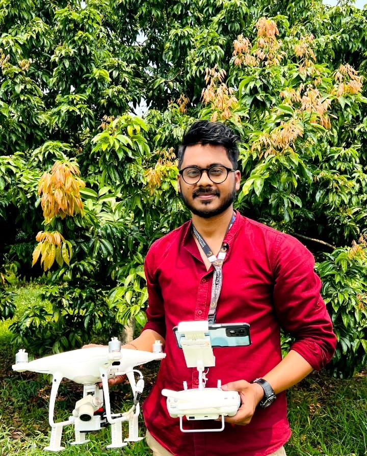
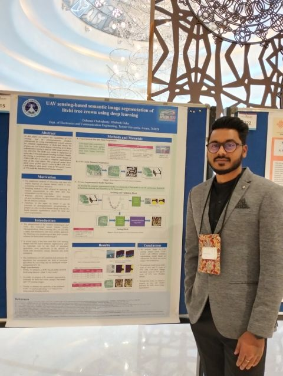
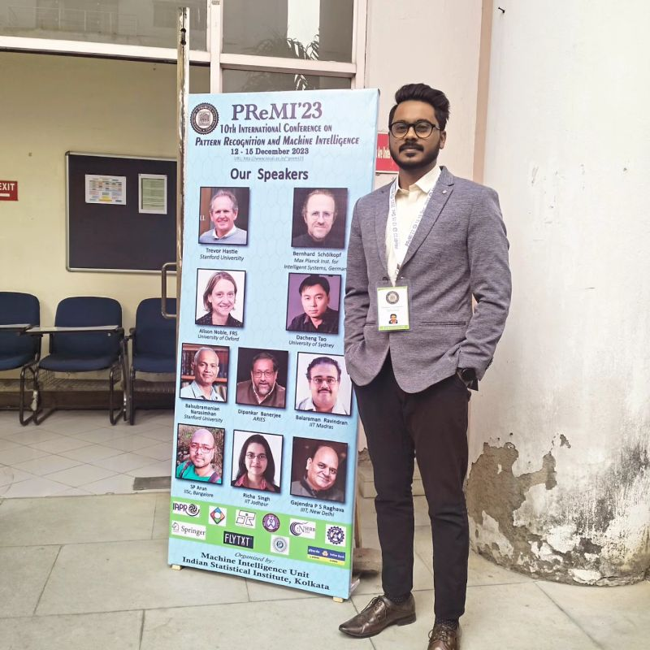
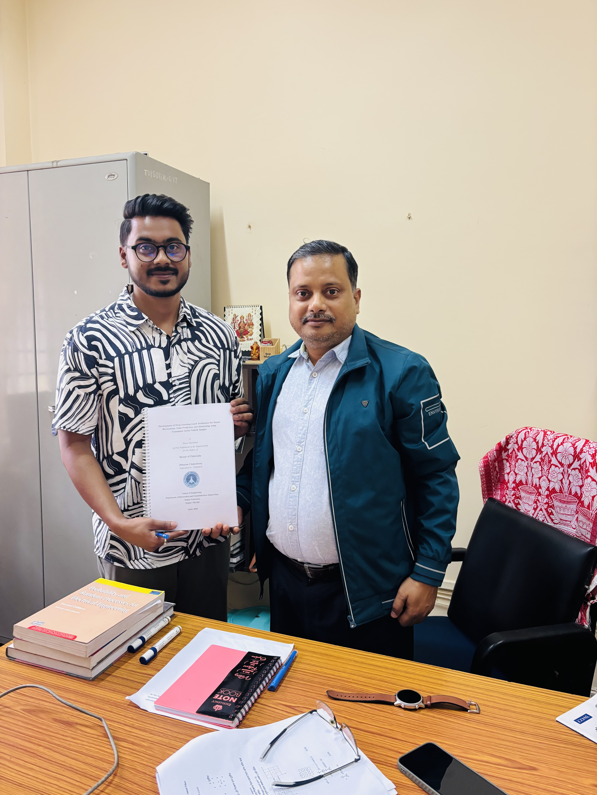

# 👨‍💻 Debarun Chakraborty (Project Research Scientist C)

  

  
  
  

---

## 🎓 About Me

<table>
<tr>
<td width="30%" align="center">
    
  
</td>

<td width="70%">

<b>Mr Debarun Chakraborty</b> is currently pursuing his <b>Ph.D.</b> at the <b>Intelligent Imaging and Vision Research Laboratory (IIVRL)</b>, Department of Electronics and Communication Engineering, Tezpur University. 
His research focuses on <b>Deep Learning for Precision Agriculture</b>, leveraging <b>UAV-based sensing imagery</b> and <b>multimodal data fusion</b>. He is particularly interested in designing <b>optimized fusion architectures</b> on <b>CUDA-enabled GPGPU systems</b> to advance intelligent models for both <b>agriculture</b> and <b>biomedical applications</b>.
He has developed innovative solutions for <b>crop management</b> and <b>EEG-based mental health disorder detection</b>, significantly improving data analysis and interpretation.
Currently, he serves as a <b>Project Research Scientist-C</b> at Tezpur University under an <b>ICMR-funded project</b>, focusing on <b>multimodal deep learning </b> using <b>Ear-EEG</b> and <b>Photoplethysmography (PPG)</b> to develop an <b>AI-based mental health alert system</b> integrated with smartphone applications.
In addition, he demonstrated strong leadership as the <b>Chairperson of the IEEE Student Branch</b> (2021–2023), actively contributing to academic and professional development initiatives.

</td>
</tr>
</table>
---

## 🔬 Research Interests
Computer Vision, Deep Learning, Precision Agriculture, Bio-medical signal processing  

---

## 🆕 Featured

  <table>
    <tr>
      <td align="center" style="padding-right: 20px;">
         
        <b>IEEE APSCON 2023</b>
      </td>
      <td align="center" style="padding-right: 20px;">
         
        <b>PREMI 2023 Conference</b>
      </td>
      <td align="center">
         
        <b>Thesis submission, 16 April 26 </b>
      </td>
    </tr>
  </table>

---
## 💼 Employment History

- **Project Research Scientist C**  
  *Tezpur University, Assam* (April 2025 – Present)  
  - Working on an ICMR-funded project on IoMT and AI-based mental health alert systems using EEG & PPG signals.

- **Teaching Assistant**  
  *Tezpur University*  
  - Digital Image & Video Processing (2025)  
  - Machine Learning & Deep Learning (2023–2024)

- **Data Science Teaching Assistant**  
  *EdYoda (ZekeLabs Technologies Pvt. Ltd.)* (2023)

- **Chairperson, IEEE Student Branch**  
  *Tezpur University* (2021–2023)

- **Teaching Assistant**  
  *North Eastern Hill University* (2018–2019)

- **Guest Lecturer**  
  *LCB College, Guwahati* (2016)

---

## 🎓 Education

- **Ph.D.** – Tezpur University (2020–2025)  
  Area of research: *Computer Vision & Deep Learning*
  Thesis Title: Development of Deep Learning-based Techniques for Smart Horticulture Yield Prediction and Monitoring using Unmanned Aerial Vehicle Images. (Pre-Thesis Completed)
  

- **M.Tech (ECE)** – NEHU (2017–2019)  
  Area: *Machine Learning*
  Project title: Supervised and Unsupervised Blind Source Separation of multi-channel mixed signal using ICA and Deep Clustering K-means Algorithm.

- **M.Sc (ECT)** – Gauhati University (2014–2016)  
 Area:  *Embedded Systems*
 Project title: Android application-based monitoring and controlling of movement of a remotely controlled robotic car mounted with various sensors via Bluetooth.

---

## 📄 Publications

## 💡 Patent

1. Debarun Chakraborty and Bhabesh Deka; Invention Title: A vision-based photogrammetric measurement system for Litchi crop management automation, Application no. 202431081191 A. (Published
on 24 Oct. 2024)

---

### 📝 Journals

1.  B. Deka, Chakraborty, Debarun, and B. D. Baro, “Uavlitchi: A uav-based benchmark dataset for litchi fruit segmentation and detection in natural environment,” Next Research, p. 101 479, 2026. 

2.  R. K. Roy, K. Sarma, Chakraborty, Debarun, A. Sarkar, and T. Bezboruah, “Development of non-contact and real-time thickness measurement system of a solid object based on ultrasonic sensing method,” IEEE Sensors Letters, 2026.

3.  D. Chakraborty and B. Deka, “Deep learning-based selective feature fusion for litchi fruit detection using multimodal uav sensor measurements,” IEEE Transactions on Artificial Intelligence, vol. 6, no. 7, pp. 1932–1942, 2025.

4.  S. Pohthmi, B. Deka, M. K. Hazarika, and Chakraborty, Debarun, “Early detection of bruises in khasi mandarin (citrus reticulata blanco) for the assessment of post harvesting losses: A machine learning approach,” Multidisciplinary Research Journal, vol. 1, no. 1, pp. 42–52, 2025.

5.  Deka and Chakraborty, Debarun, “UAV sensing-based litchi segmentation using modified mask-rcnn for precision agriculture,” IEEE Transactions on AgriFood Electronics, vol. 2, no. 2,
pp. 509–517, 2024.  doi: 10.1109/TAFE.2024.3420028.

6.  K. Sarma, F. Pyrtuh, and Chakraborty, Debarun, “Speaker verification system using wavelet transform and neural network for short utterances,” Asian Journal For Convergence In Technology
(AJCT) ISSN-2350-1146, vol. 6, no. 1, pp. 30–35, 2020.
 
 

## 📘 Book Chapter
1.  Chakraborty, Debarun and B. Deka, “Litchi Fruit Instance Segmentation from UAV Sensed Images Using Spatial Attention-Based Deep Learning Model,” in Pattern Recognition and Machine Intelligence, S. Das, K. Deb, et al., Eds., Cham: Springer, 2023, pp. 862–870.

 
### 📢 Conferences

1.  Chakraborty, Debarun and B. Deka, “Photogrammetry-based litchi tree crown area estimation using UAV optical sensor,” in INTERNATIONAL CONFERENCE ON DEVICES, SENSORS AND SYSTEMS
(CODSS), 2024 (Accepted for proceedings), Best Paper in poster Category; Track: System.

2.  Chakraborty, Debarun and B. Deka, “UAV sensing-based semantic image segmentation of litchi tree crown using deep learning,” in 2023 IEEE Applied Sensing Conference (APSCON), IEEE, 2023, pp. 1–3.

3.  Chakraborty, Debarun and K. Sharma, “A study on blind source separation using ICA algorithm in terms of invertible system’.,” vol. 6, 2019, pp. 2350–0077.

4.  Chakraborty, Debarun, “Design and implementation of colour objects sorting robotics system based on programmable color light-to-frequency converter technique.,” in TECHNOVA-2016, Krishi
Sanskritti Publication, New Delhi, India., 2016.

5.  Chakraborty, Debarun, K. Sharma, R. K. Roy, H. Singh, and T. Bezboruah, “Android application based monitoring and controlling of movement of a remotely controlled robotic car mounted with
various sensors via bluetooth,” in 2016 International Conference on Advances in Electrical, Electronic and Systems Engineering (ICAEES), IEEE, 2016, pp. 170–175.

---

## 🚀 Projects

### 🌱 Deep Learning & Signal Processing
- Blind source separation using ICA and deep clustering
- Title: Supervised and Unsupervised Blind Source separation of mixed signal using ICAand deep clustering Kmeans Algorithm.
- Tools: Python, TensorFlow, MATLAB

### 🤖 Robotics
- Bluetooth-controlled robotic car with sensor integration
- Title: Android Application based monitoring and controlling of movement of a remotely controlled Robotic car mounted with various sensors via Bluetooth. Tech: Ardiuno
UNO, Ultrasonic Sensor, Bluetooth Module, HDT11 Sensor. (2016).

### 🔧 Embedded Systems
- Title: Design and Implementation of colour objects sorting robotics system based on programmable colour light-to frequency converter technique. Tech: Ardiuno UNO, Ultrasonic
Sensor, Bluetooth Module, GY-31 TCS3200 Color Sensor Module. (2017).

---

## 🛠️ Skills

### 💻 Programming
- Python, MATLAB, LaTeX

### 🧠 Tools & Software
- TensorFlow, Keras  
- Pix4Dmapper, LabelImg  
- Origin, Power BI  

### 🌐 Web
- HTML

### 🗄️ Databases
- MySQL

---

## 🏆 Achievements

- 🥇 Best Poster Award – CODSS 2024  
- 🎓 UGC-NET Qualified (2019)  
- 📜 Deep Learning Certification (Internshala)  
- 🌍 ISRO Course on Geospatial Technology  

---

## 👥 Memberships

- IEEE Graduate Student Member  
- IEEE Young Professional Member  
- International Association of Engineers  

---

## 📌 Additional Contributions

- Reviewer: IEEE Transactions on Instrumentation & Measurement  
- Reviewer: JENRS Journal  
- Experience in academic research, teaching, and scientific writing  

---

---

⭐ *Feel free to explore my repositories and connect with me for collaborations in AI, Computer Vision, and Smart Agriculture!*
